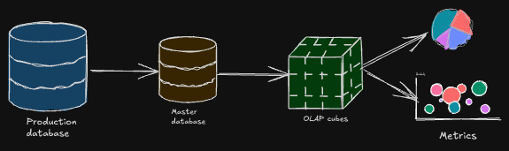

Im sharing my learning from the Data Engineering Bootcamp, where we are learning about Data Engeering. Today we are learning about Dimensional modelling - Cumulative Table.

I would like to extend my gratitude to Zach Wilson, the founder of [DataExpert.io](https://bootcamp.techcreator.io/lessons), for his invaluable guidance and the comprehensive Data Engineering Bootcamp.
Connect with Zach Wilson on [LinkedIn](https://www.linkedin.com/in/eczachly/).
Thank you, Zach, for this amazing intense bootcamp on Data engineering!

---

Day-1: Dimensional Modelling (Theory)

## What is a Dimension?

Dimension are `attributes` of an entity ( example: user's name, age etc)
    - Dimensions may be `IDENTIFY` an entity, which would be a unique identifier for the entity (example: user_id, device_id etc)
    - Dimensions may be `DESCRIPTIVE` which would be the attributes of the entity (example: user's name,age etc) but wont be unique.

<!-- truncate -->

Dimensions comes in two flavors:
    - `Slowly Changing Dimensions` : Dimensions that change over time like user's address, phone number etc. This attribute is time dependent. Can be painful deal with these attributes.
    - `Fixed`: Dimensions that do not change over time like user's birthdate. These are easy to deal with.

:::info
Knowing whether the attributes are slowly changing or fixed is important to design the data model.
:::
## Knowing your data consumer

`Who is using your data?` is the most important question to ask before designing the data model. The data model should be designed in such a way that it is easy for the data consumer to understand the data.

Whether the data is getting delivered to:
1. Data Analyst / Data Scientist: 
    - They would be interested in the data that is `easy to understand and analyze`.
    - They wouldnt be interested in dealing with `complex data types` like JSON, XML etc.
2. Data Engineers:
    - Sometimes downstream systems would be handled by Data Engineers, to take your data sets and join with other data to achieve the buisness logic, so the data model be compact and probably harder to query.
    - Nested types are fine to model the data.
    - Usually, as we get further up in ladder of data engineering, there would be `Master Data` which would be used by other data engineers or teams, to join the master data with other data sets.
3. ML models:
    - Generally machine learning models would need `identifier` and bunch of flattened decimal columns like `feature value columns` etc.
    - Sometimes it depends on the model, the model can sometime handle the complex data structures, similiar to what Data analyst and data scientist would need.
4. Customers
    - You would never give the data directly ( like JSON, CSVs etc) to the customers, you would always give them the `dashboards` or `reports` which would be easy to understand and analyze.

> Not knowing your data consumer, there is a high chance that the data model would be designed in a wrong way, can lead to business loss.

## OLTP Vs OLAP Vs Master Data

1. OLTP(Online Transaction Processing):
    - OLTP is the system that is used to record the transactions that are happening in the system.
    - The data model is optimized for `low latency` and `low-volume` queries, usually dealing with `single record` at a time.
    - Usually Software Engineers model the data in OLTP.
    - The data model in OLTP is `3NF` (Third Normal Form) which means the data is broken down into multiple tables and the data is not repeated.
    - Databases: MySQL, Postgres etc.
2. OLAP(Online Analytical Processing):
    - OLAP is the system that is used to analyze the data that is stored in the OLTP system.
    - The data model is optimized for `high volume` and `complex queries`, using `aggregations` and `joins`.
    - Usually `Data Engineers` model the data in OLAP.
    - Analytical Databases: Redshift, BigQuery etc.
3. Master Data:
    - Master Data is optimied for completeness of entity definition and deduped.
    - Master Data is usually a middle layer between OLTP and OLAP.

## Impacts of Mismatched Data Model
:::info
 Mismatching needs of the data consumer == Less business value
:::

- When you model transaction system as analytical system, like transactional system usually need only one record at a time, but if you model it as analytical system, you would retrieve all the unnecessary data which would be a performance hit.
- When you model analytical system as transactional system, like analytical system usually need to aggregate the data, but if you model it as transactional system, you would have to do the aggregation/joins on the fly which would be a performance hit.
- Having the Master Data as middle layer, would give you the flexibility whichever data model you want to use.

## OLTP and OLAP is a continuum

- `Production Database Snapshot`: Usually the data in Production databases are transactional data, which is used to record the transactions that are happening in the system/web application/mobile application etc.
- `Master Data`: Taking the production datasets and creating the master data, for easy to understanding. Instead of querying "many" transactional databases, merging them into master data would be much efficient.
- `OLAP Cubes`: 
    - You would flatten the data, like you might have multiple rows per entity, where you can aggregate the data.
    - OLAP Cubes space is also create the slice and dice the data.
- `Metrics`: You would aggregate even further to get the one number which would be like `KPIs` of the business.

## Cumulative Table Design

- Some days not every user would be active, but still master data should hold the details of the user.
- Cumulative table is the table that holds the `history of the data`.

*The way cumulative table is designed is*:
- You would have 2 datasets like `today` and `yesterday`.
- `Full Outer Join` is done on the datasets, to get all the data, pulling the history data every day.
- `Coalesce` is used to get the latest data.

*Where is it used?*
- `Growth Analysis`: To see how the data is growing over time.
- `State transition tracking`: To see how the data is changing over time.

:::warning
- Cumulative table gets bigger and bigger over time, so applying the filtering on the data is important.
:::

*Cumulative Table: Strengths and Drawbacks*

| **Category**  | **Strengths**                                                                 | **Drawbacks**                                                                                           |
|----------------|-------------------------------------------------------------------------------|--------------------------------------------------------------------------------------------------------|
| **Analytics** | - Enables historical analysis without shuffling or reprocessing the data.    | - Sequential backfilling can limit flexibility when correcting or reprocessing older data.             |
| **Tracking**  | - Easy to track changes and transitions over time.                           | - Incremental growth of data size over time, leading to storage and performance challenges.             |
| **Data**      | - Provides a complete snapshot of trends and transitions.                   | - Retains potentially outdated or deleted PII data, complicating compliance with data privacy laws.     |

## The compactness vs usability tradeoff

- The most usable tables usually are
    - They are straightforward, they would have identifier for dimensional model.
    - Have no complex data types.
    - Easily can be manipulated with `WHERE` and `GROUP BY` clauses.
- The most compact tables usually are
    - Are compressed to be as small as possible, which would be harder to query directly until they're decoded.

- The middle-ground table:
    - Where you would use complex data types (e.g. ARRAY, STRUCT, MAP) to model the data, which would be harder to query directly but can be used to join with other data sets.

*When would you each type of table?*
- Most compact:
    - Online systems where latency and data volume are critical. 
    - Consumers are usually hihgly technical and can handle complex data types.
- Most usable:
    - When analytics is the main consumer
    - The majority of the consumer are less technical and need the data to be easy to understand and analyze.
- Middle-ground:
    - Upstream staging/master data are used by majority of consumers who are other data engineers.

## Struct Vs Array Vs Map

| **Feature**           | **Struct**                                        | **Map**                                      | **Array**                                    |
|------------------------|--------------------------------------------------|---------------------------------------------|---------------------------------------------|
| **Definition**         | A table within a table.                          | A key-value pair structure.                 | A list of values.                           |
| **Keys**              | Rigidly defined, improving compression.          | Flexible, less compression efficiency.      | Not applicable (index-based).              |
| **Values**            | Can be of any type.                              | Must all be of the same type.               | Must all be of the same type.               |
| **Usage**             | Suitable for structured data with predefined keys.| Best for flexible key-value relationships.  | Ideal for ordered collections of data.     |
| **Complexity**         | Higher due to nested structure.                  | Simpler, dynamic key-value management.      | Simplest among the three; index-based access. |
| **Nesting**           | Supports nesting within itself or arrays.         | Can be nested inside structs or arrays.     | Can contain structs or maps as elements.   |

## Impact of adding a temporal (time-based) dimension

1. **Cardinality Explosion**:
   - Adding a time dimension (e.g., days, nights, or timestamps) increases the number of unique combinations in the dataset. This often grows by at least **one order of magnitude** (10x or more).
   - Example: Airbnb has ~6 million listings. If we want to track the nightly availability and pricing for each listing for a year, it results in:
     - **365 days × 6 million listings = ~2 billion rows** of data.

2. **Challenges with Dataset Design**:
   - **Option 1**: You could store this data as a single listing with an array (list) of 365 nights. This approach is compact but may be harder to query efficiently.
   - **Option 2**: Alternatively, store it as 2 billion rows, where each row represents one listing-night combination. While this structure is easier to query, it increases the dataset size significantly.

3. **Using the Parquet**:
   - Using efficient file formats like **Parquet**, which compresses data well, helps to reduce the size of both approaches. With proper sorting and organization, you can minimize storage overhead.

:::warning
Badness of denormolized temporal dimension: if you have to join the data with other dimensions, spark shuffle will ruin the compression.
:::

## Run length encoding compression

- [Run length encoding](https://en.wikipedia.org/wiki/Run-length_encoding)  is a form of lossless data compression in which runs of data (consecutive occurrences of the same data value) are stored as a single occurrence of that data value and a count of its consecutive occurrences, rather than as the original run. [1]
- RLE is one of reasons why Parquet is so efficient for storing data.
- However, **shuffle can ruin this efficiency**. Since shuffle happens in a distributed environment during JOIN and GROUP BY operations, data is redistributed across nodes, and compression benefits like RLE are often lost.

---
[1]: source from wikipedia