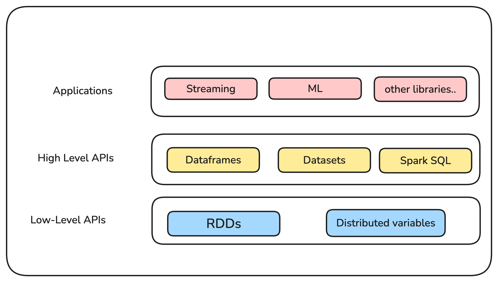

import SocialLinks from '@site/src/components/SocialLinks/socialLinks.js'

Day 1/45 of Apache Spark

Welcome to my **40 Days of Apache Spark** series! Over the next 45 days, I’ll dive deep into Apache Spark, from basics to advanced concepts. This series is about learning, exploring, and sharing—documenting my journey to mastering Apache Spark while sharing insights, challenges, and tips.

In this first post, we’ll cover the fundamentals of Apache Spark, its history, and why it’s a game-changer in data engineering 💡🔥

Find all the blogs in the series [here](/blog/tags/apache-spark).
<!-- truncate -->

## Spark History
Apache Spark started as a research project by [Matei Zaharia](https://www.linkedin.com/in/mateizaharia/) at the University of California, Berkeley's AMPLab in 2009 which focuses on big analytics. The project was open-sourced in 2010, initially focused on MapReduce computing with a faster API.

The aim was to design a programming model that supports a much wider class of applications than MapReduce, while maintaining its automatic fault tolerance.

### Motivation for Apache Spark
At the time, MapReduce was the de facto standard for big data processing, but it had notable limitations:

- **Inefficiency for Complex Applications**: MapReduce required multiple disk I/O operations, as each intermediate computation step wrote data to disk, significantly slowing down iterative tasks like machine learning algorithms or graph processing.
- **Rigid Programming Model**: Developers were constrained to writing programs in the Map and Reduce paradigm, making it less intuitive for complex workflows or real-time analytics.
- **Lack of In-Memory Processing**: MapReduce did not leverage in-memory computation effectively, leading to unnecessary overhead in cases where intermediate data could be reused.

These shortcomings paved the way for **Apache Spark**, designed to address these inefficiencies with its distributed in-memory computation framework. Spark introduced a more flexible programming model and faster execution capabilities, making it ideal for iterative algorithms and large-scale data processing.

## What is Apache Spark?

Apache Spark is an <Highlight color="#3e6980">open-source, unified computing engine and libraries for distributed data processing</Highlight>.

- **Unified Computing Engine**
    - Spark provides a variety of data processing tasks like data loading, SQL queries, machine learning, and graph processing in a single framework etc.
    - It is consistent and composable API in multiple languages like Scala, Java, Python, and R.
    - It can optimizations across different libraries and workloads.
    - Computing Engine: Spark is completely detached from where the data resides and data is being fetched

- **Distributed Data Processing**: 
    - Spark is designed to process large volumes of data in parallel across a cluster of machines.

:::warning

Spark is not a database, it is a distributed computing engine that can process large volumes of data in parallel across a cluster of machines.

:::

## Why Apache Spark?

Spark is designed to enhance the capabilities of Hadoop, particularly for applications involving <Highlight color="#3e6980">iterative jobs and interactive analytics </Highlight> where data reuse is crucial. 

* **Superior Performance for Iterative Tasks:** Spark excels in iterative jobs common in machine learning. It <Highlight color="#3e6980">caches data in memory across iterations</Highlight>, eliminating the need to reload from disk for each cycle, resulting in substantial performance gains over Hadoop.

* **Enabling Interactive Data Exploration:** Spark empowers users with <Highlight color="#3e6980">sub-second response times for interactive queries on large datasets</Highlight>. Unlike Hadoop, which incurs significant latency for each query, Spark provides an experience comparable to working with data locally. 

* **Resilience and Fault Tolerance:** Spark leverages the concept of Resilient Distributed Datasets (RDDs). RDDs track data lineage, allowing for <Highlight color="#3e6980">efficient reconstruction of lost partitions in case of node failures</Highlight> without relying on resource-intensive checkpointing.

* **Efficient Data Sharing:** Spark offers broadcast variables, enabling the distribution of large read-only datasets across worker nodes only once. This contrasts with Hadoop's distributed cache, which is limited to single jobs, resulting in reduced data transfer overheads. 

* **Simplified Programming Model:** Spark's abstractions like RDDs, shared variables, and parallel operations offer a <Highlight color="#3e6980">higher-level, more user-friendly programming model compared to Hadoop</Highlight>. Its integration with languages like Scala promotes interactive development and simplifies the expression of complex computations. 

:::info

Spark is not a part of the Hadoop ecosystem, but it can run on top of Hadoop YARN, providing a more efficient and flexible alternative to MapReduce for data processing.

:::

## Spark Ecosystem

| **Component**       | **Purpose**                                | **Key Features**                                                                 | **Use Cases**                                   |
|----------------------|--------------------------------------------|----------------------------------------------------------------------------------|------------------------------------------------|
| **Spark Core**       | General-purpose distributed computing.     | Task scheduling, memory management, fault recovery, and interaction with storage.| Foundation for all other Spark components.     |
| **Spark SQL**        | Structured data processing.                | SQL queries, DataFrames/Datasets, Hive integration, and schema management.       | Batch processing, data warehousing, ETL tasks. |
| **Spark Streaming**  | Real-time data processing.                 | Processes data in micro-batches, supports Kafka, Flume, and file streams.        | Real-time dashboards, log monitoring.          |
| **MLlib**            | Machine learning library.                  | Algorithms for classification, regression, clustering, and recommendation.       | Predictive analytics, recommendation engines.  |
| **GraphX**           | Graph processing and computation.          | API for graph-parallel computations, pre-built graph algorithms.                 | Social network analysis, PageRank.             |
| **SparkR**           | R-based analytics in Spark.                | R frontend for statistical analysis and machine learning using Spark.            | Data exploration, statistical modeling.        |

## References

1. [Spark + AI Summit 2020 - Matei Zaharia Keynote](https://youtu.be/OLJKIogf2nU?si=m0l_73WADiwmL4I0)
2. [Apache Spark Documentation](https://spark.apache.org/docs/latest/index.html)
3. [Wiki - Apache Spark](https://en.wikipedia.org/wiki/Apache_Spark)

I hope you enjoyed reading this blog on Apache Spark introduction . If you have any questions or feedback, feel free to reach out to me on <SocialLinks />