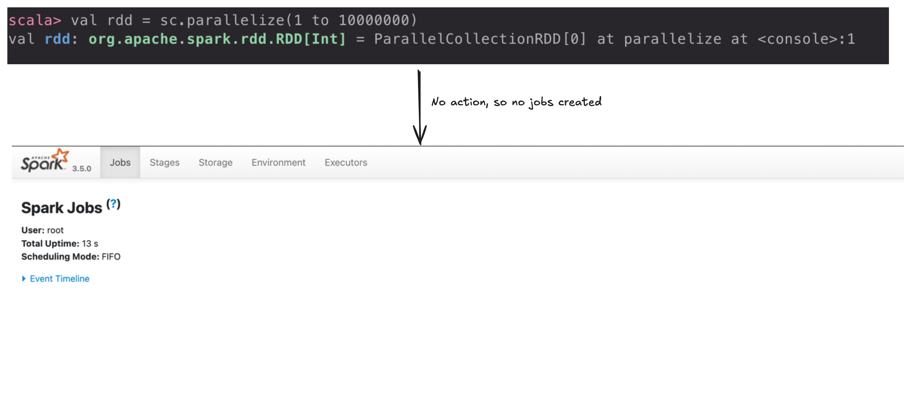
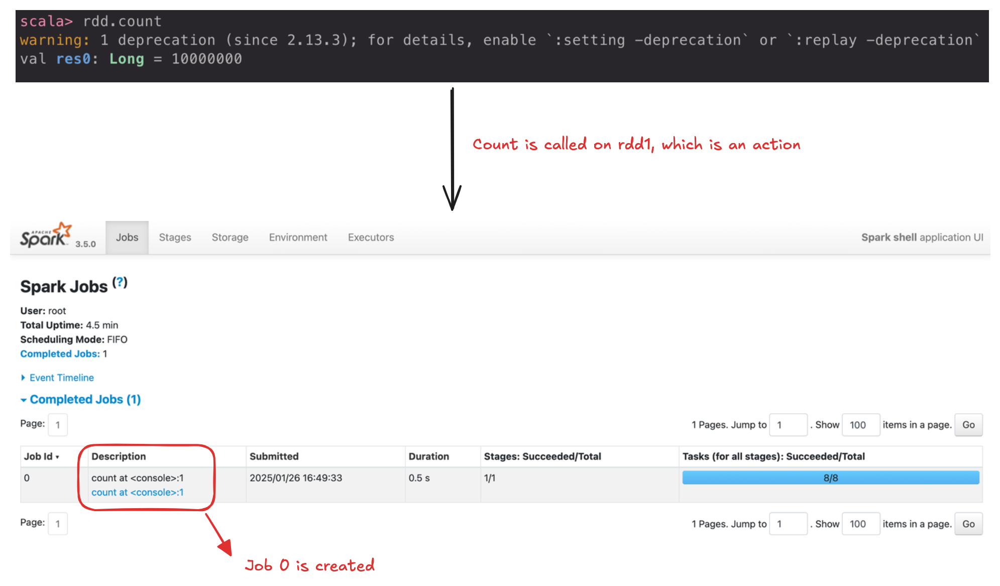
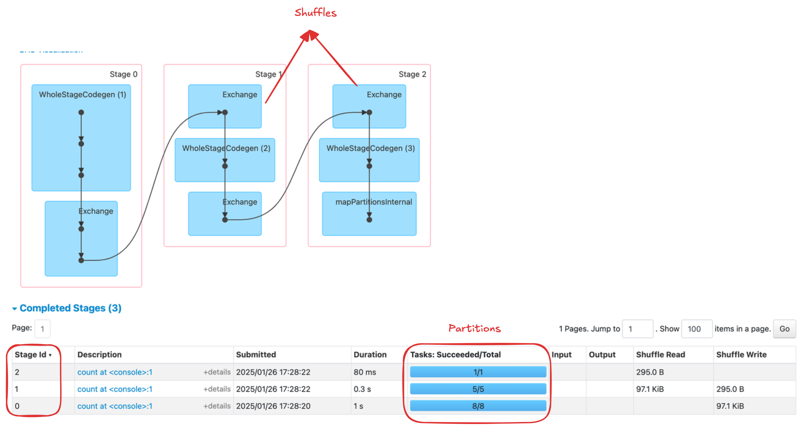

import SocialLinks from '@site/src/components/SocialLinks/socialLinks.js'

Understanding the internal execution flow of a Spark application is key to optimizing performance and debugging. This blog dives into the details of `Spark jobs`, `stages`, and `tasks`, providing a thorough exploration of how Spark handles distributed execution.

<!-- truncate -->

## Spark Job Anatomy
### Jobs
Each application is made up of one or more Spark jobs. Spark jobs within an application are executed serially. In general, a job is created for <Highlight color="#3e6980">each action operation</Highlight> in the spark application.

Each job breaks down into a series of stages, the number of which depends on how many shuffle operations need to take place.

Since Spark [evaluates lazily](https://en.wikipedia.org/wiki/Lazy_evaluation), the job is not executed until an action is called. If there are no actions, there are no jobs.



When an action is called on a RDD/DF, a job is created.



Key Features of Spark Jobs:
- Each job is composed of multiple stages.
- Spark generates one job per action.
- Jobs are independent and can run in parallel if no dependencies exist between them.

### Stages

A stage is a group of tasks that Spark can run together to perform the same operation across multiple machines. While Spark tries to include as much work as possible in one stage, it creates a new stage whenever there’s a shuffle operation.

A shuffle happens when <Highlight color="#3e6980">Spark redistributes data across partitions or nodes in the cluster</Highlight> to complete certain operations. It involves a physical rearrangement of the data to meet the needs of the computation.

<u>For example</u>:
Sorting a DataFrame, or grouping data that was loaded from a file by key (which requires sending records with the same key to the same node). 

This type of repartitioning requires coordinating across executors to move data around. Spark starts a new stage after each shuffle, and keeps track of what order the stages must run in to compute the final result

```
scala> val df1 = spark.range(2, 10000000, 2) 
val df1: org.apache.spark.sql.Dataset[Long] = [id: bigint]

scala> val step1 = df1.repartition(5)
val step1: org.apache.spark.sql.Dataset[Long] = [id: bigint]

scala> step1.count()
val res0: Long = 4999999
```



In the above example:
- The the 1st stage (stage-0) correspond to the `range` that you perform in order to create your DataFrames. By default when you create a DataFrame with range, it has `8 partitions`.
- The next stage (stage-1) is the `repartitioning`. This changes the number of partitions by shuffling the data. These DataFrames are shuffled into `5 partitions`.
- The final stage (stage-2) is the `count action`. This is the final stage that is executed.


``` scala
val df1 = spark.range(2, 10000000, 2)
val df2 = spark.range(2, 10000000, 4)
val step1 = df1.repartition(5)
val step12 = df2.repartition(6)
val step2 = step1.selectExpr("id * 5 as id")
val step3 = step2.join(step12, ["id"])
val step4 = step3.selectExpr("sum(id)")
```


- Stages 3 and 4 perform on each of those DataFrames and the end of the stage represents the join (a shuffle). 
- Suddenly, why we have 200 tasks? This is because of a Spark SQL configuration. The `spark.sql.shuffle.partitions` default value is 200, which means that when there is a shuffle performed during execution, it outputs 200 shuffle partitions by default. However you can change this value, and the number of output partitions will change.

:::note
A good rule of thumb: The number of partitions should be larger than the number of executors on your cluster, potentially by multiple factors depending on the workload. 
:::

### Tasks

A task is just a <Highlight color="#3e6980">unit of computation applied to a unit of data (the partition)</Highlight>. Stages in Spark consists of tasks. Each task corresponds to a combination of blocks of data and a set of transformations that will run on a single executor.

Partitioning your data into a greatest number of partitions means that more can be executed in parallel.

## Summary

Easy way to remember how Spark organizes work:

| **Topic**                 | **Key Points**                                                                                                                                                                          |
|---------------------------|-----------------------------------------------------------------------------------------------------------------------------------------------------------------------------------------|
| **App Decomposition**     | - 1 Spark Application can have 1 or more Jobs. <br/> - Each Job is broken into 1 or more Stages.                                                                                       |
| **Stages & Tasks**        | - Each Stage is subdivided into Tasks. <br/> - Shuffle boundaries (data rearrangements) define when Spark moves from one Stage to the next.                                            |
| **Tasks & Executors**     | - One Task runs on one Executor (it can’t move mid-task). <br/> - An Executor can run multiple Tasks (depending on its available cores).                                                |
| **Partitions & Tasks**    | - Processing one partition = one Task. <br/> - The number of Tasks in a Stage often equals the number of partitions for that data.                                                     |
| **Partitions & Executors**| - A partition stays on one Executor while it’s being processed. <br/> - Each Executor can hold 0 or more partitions in memory or on disk.                                              |
| **Executors & Nodes**     | - 1 Executor corresponds to 1 JVM running on 1 physical/virtual Node. <br/> - Each Node can host 0 or more Executors.                                                                   |

Use this table as a handy to keep the Spark “big picture” in mind:

1. Spark **Applications** → **Jobs** → **Stages** → **Tasks**.  
2. A **Task** processes a **Partition**.  
3. **Executors** (JVMs) on cluster **Nodes** do the actual work.

## References

1. [Spark: The Definitive Guide](https://www.amazon.com/Spark-Definitive-Guide-Processing-Simple/dp/1491912219)
2. [Apache Spark Documentation](https://spark.apache.org/docs/latest/index.html)

I hope you enjoyed reading this blog, if you are interested in learning other topics related to Apache Spark, feel free to check [Apache Spark](/blog/tags/apache-spark) series.

If you have any questions or feedback, feel free to reach out to me on <SocialLinks />