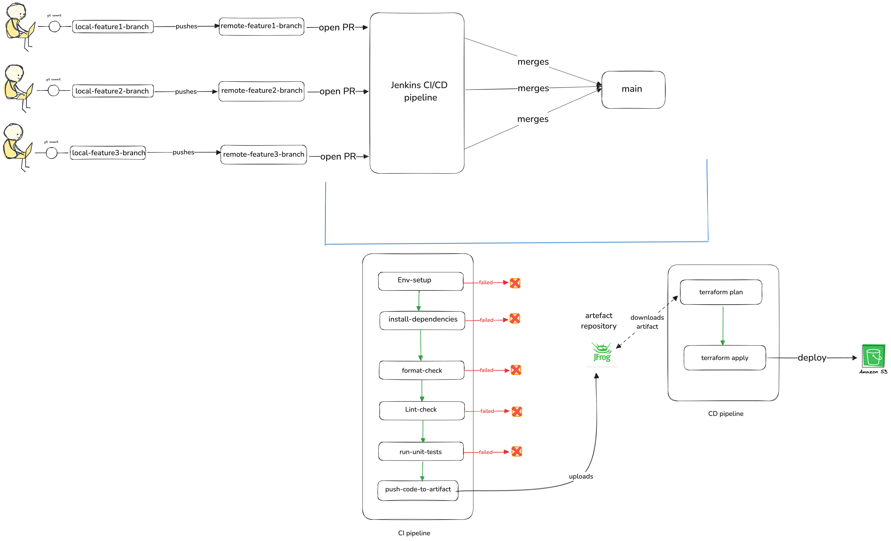

import SocialLinks from '@site/src/components/SocialLinks/socialLinks.js'

In this blog, we’ll explore how to set up a complete CI/CD pipeline using `Jenkins`, `pytest`, and `Terraform` to automate unit testing and deployment for AWS Glue and Lambda jobs. You’ll also learn how to manage Python dependencies using `uv` and `pyproject.toml`, use `JFrog Artifactory` to store and retrieve build artifacts, and enforce code quality with `Ruff`.

<!-- truncate -->

## Summary

Automating the execution of unit tests within a DevOps pipeline is indispensable for ensuring the integrity, resilience, and maintainability of distributed data systems. As a data engineer, I’ve worked on setting up Jenkins pipelines that streamline the development lifecycle. These pipelines have brought noticeable improvements in code quality, deployment consistency, and developer confidence.

This comprehensive guide presents a production-ready approach to:
- Automating unit testing for AWS Glue and Lambda Python applications using `pytest`
- Enforcing code quality with `ruff` (replacing flake8, black, and isort)
- Managing dependencies efficiently with `uv` and `pyproject.toml`
- Packaging and publishing artifacts via `JFrog Artifactory`
- Deploying verified code to Amazon S3 via `Terraform`
- Executing downstream Glue or Lambda jobs using the uploaded package

---

## CI/CD Lifecycle Overview

### Continuous Integration (CI)

Triggered on each commit or pull request, the CI pipeline performs the following operations:

1. **Initialize Environment**: Initialize Environment: Use `uv` to set up and sync dependencies from pyproject.toml.
2. **Install Dependencies**: Install project requirements from `pyproject.toml`.
3. **Code Quality Check**:
    1. **Formatting**: Use `uv run ruff format --check` to auto-format your code consistently.
    2. **Linting**: Use `uv run ruff check .` to detect syntax issues, unused imports, and common code errors.
    3. **Import Sorting**: Use `uv run ruff check --select I` to enforce import order rules.
4. **Unit Testing**: Execute `uv run pytest` and produce JUnit reports.
5. **Artifact Packaging**: Zip the tested code and upload it to JFrog Artifactory.

:::tip

Using `Formatter` first and then `linter` will save you time and effort in fixing the linting issues, you will thank me later ;)

:::

### Continuous Deployment (CD)

Upon CI success, CD automates infrastructure provisioning and code deployment:

1. **Artifact Download**: Retrieve the latest build from Artifactory.
2. **Terraform Plan**: Generate a preview of infrastructure changes.
3. **Terraform Apply**: Apply changes to provision or update cloud resources.
4. **Trigger Execution**: Enable Glue or Lambda jobs to consume the new code from `S3`.



---

## Step 1: Modularizing Code for Testability

**Python Code Structure**

```bash
data-pipeline/
├── pyproject.toml
├── Jenkinsfile
├── src/
│   ├── __init__.py
│   ├── handler.py         # Lambda handler logic
│   ├── transform.py       # Glue transformations or shared business logic
├── tests/
│   ├── __init__.py
│   ├── test_handler.py
│   └── test_transform.py
├── scripts/
│   └── deploy.sh          # Optional scripts for local testing or deployment
└── README.md
```

**Glue Example**
```python

# transform.py
def clean_name(data):
    return [{"name": item["name"].strip().lower()} for item in data]

```

---

## Step 2: Writing and Executing Unit Tests

**Basic Unit Test with Pytest**

```python
from transform import clean_name

def test_clean_name():
    input_data = [{"name": " John "}]
    expected_output = [{"name": "john"}]
    assert clean_name(input_data) == expected_output
```


Run locally:
```bash
uv run pytest tests/
```

**Mocking AWS Services with Moto**

```python

from moto import mock_s3
import boto3

def test_s3_upload():
    with mock_s3():
        s3 = boto3.client('s3', region_name='us-east-1')
        s3.create_bucket(Bucket='test-bucket')
        s3.put_object(Bucket='test-bucket', Key='file.txt', Body='test')
        response = s3.get_object(Bucket='test-bucket', Key='file.txt')
        assert response['Body'].read().decode() == 'test'

```

**Sample Pyproject.toml for Dependency Management**

```toml

[project]
name = "data-pipeline"
version = "0.1.0"
dependencies = [
    "boto3",
    "pytest",
    "moto",
    "ruff"
]

[tool.ruff]
line-length = 88
select = ["E", "F", "I", "UP"]
exclude = [".venv", "build"]

```

---

## Step 3: Sample Jenkins CI Pipeline Configuration

**CI Jenkinsfile using uv**
```groovy
pipeline {
    agent any
    stages {
        stage('Setup Env') {
            steps { sh 'curl -Ls https://astral.sh/uv/install.sh | sh' }
        }
        stage('Install Deps') {
            steps { sh 'uv sync' }
        }
        stage('Format') {
            steps { sh 'uv run ruff format --check' }
        }
        stage('Lint') {
            steps { sh 'uv run ruff check .' }
        }
        stage('Unit Tests') {
            steps { sh 'uv run pytest' }
        }
        stage('Publish Artifact') {
            steps {
                sh 'zip -r my_code.zip .'
                sh 'curl -u $JFROG_USER:$JFROG_PASSWORD -T my_code.zip https://your-jfrog-url/artifactory/repo-name/'
            }
        }
    }
}
```

---

## Step 4: SampleJenkins CD Pipeline + Terraform

**CD Jenkinsfile**

```groovy

pipeline {
    agent any
    environment {
        TF_VAR_code_url = 'https://your-jfrog-url/artifactory/repo-name/my_code.zip'
    }
    stages {
        stage('Terraform Init') { steps { sh 'terraform init' } }
        stage('Terraform Plan') { steps { sh 'terraform plan' } }
        stage('Terraform Apply') { steps { sh 'terraform apply -auto-approve' } }
    }
}

```

**Sample Terraform Code**

```hcl

resource "null_resource" "download_code" {
  provisioner "local-exec" {
    command = "curl -o /tmp/my_code.zip ${var.code_url}"
  }
}

resource "aws_s3_object" "upload_code" {
  bucket = "my-etl-code-bucket"
  key    = "glue_or_lambda/my_code.zip"
  source = "/tmp/my_code.zip"
}

```

---

## Toolchain Summary

1. [Jenkins](https://www.jenkins.io/) – Core CI/CD orchestrator
2. [pytest](https://docs.pytest.org/en/stable/) – Testing framework for validating business logic
3. [moto](https://docs.getmoto.org/en/latest/docs/getting_started.html) – AWS mocking tool for offline unit testing
4. [ruff](https://docs.astral.sh/ruff/) – All-in-one Python linter, formatter, and import sorter
5. [uv](https://docs.astral.sh/uv/) – Lightning-fast dependency manager for Python projects
6. [Terraform](https://www.terraform.io/) – Infrastructure as Code for AWS resource automation
7. [JFrog Artifactory](https://jfrog.com/) – Artifact repository for storing build assets

---

## Final Thoughts

Having a CI/CD pipeline in place is no longer optional — it’s foundational to any reliable data engineering workflow. Whether you're building Lambda functions, Glue jobs, or full-fledged data platforms, automating testing, validation, and deployment allows teams to move faster while maintaining confidence in every release.

---

## Next Steps

Hope this guide helps you implement a robust CI/CD pipeline for your projects. Let me know if you need running code examples or have any questions. Feel free to reach out to me on <SocialLinks />