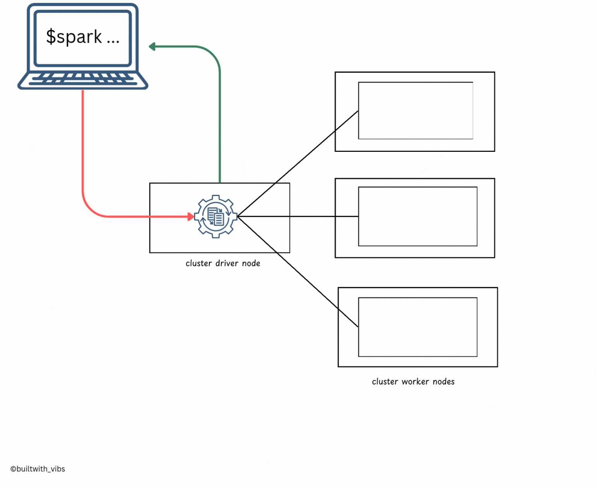
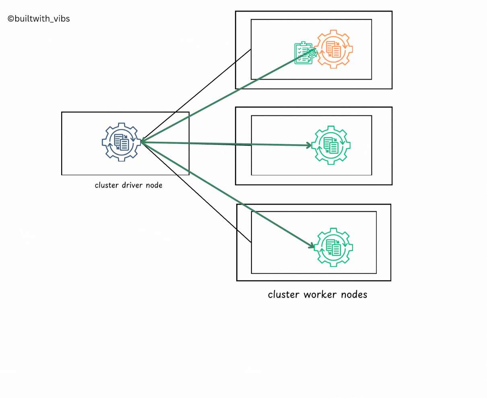

In this blog, we will go in-depth on the overall life cycle of Spark Applications from outside the actual Spark code. Before going ahead, I recommend reading the [Execution Modes](/blog/spark-execution-modes) of the Spark application.
<!-- truncate -->

## Client Request

- The first step is the client request. This is the request that is made by the user to the Spark Application. 
- This request can be made in a variety of ways: Compiled Jars or a library. The most common way is through the `Spark Submit` command Using compiled Jars. 
- At this point, the client is executing code on the local machine and is going to make a request to the cluster manager driver node.




```
./bin/spark-submit \
  --class <main-class> \
  --master <master-url> \
  --deploy-mode cluster \
  --conf <key>=<value> \
  ... # other options
  <application-jar> \
  [application-arguments]
```

The Spark Submit command takes number of arguments, for example:
- the main class of the Application
- the master URL ( local, yarn, Mesos etc )
- the deploy mode (local, cluster, client)
- the configuration of the application
- Other arguments like the number of executors to use, the amount of memory to allocate to each executor, the location of the input data.
- the location of the application jar file.

## Launch

- After the spark-submit command is executed, the driver process has been placed on the cluster, begins running user code
- The user code should contain `SparkSession`, which is responsible for initializing the Spark Cluster(eg: driver and executors).
- Subsequently, the `SparkSession` will communicate with cluster manager for launching the spark executors processors across the cluster.
- The relevant configurations like number of executors, memory, cores etc are passed to the cluster manager by user via `spark-submit` command.


## Execution

- Spark Context is created now, spark goes about executing the code.
- The driver process and executors communicate with each other, executing code and moving data between each other.
- The driver schedules tasks onto each worker, and each worker responds with the status of those tasks and success or failure. 


## Completion

- Upon completion, the driver process exits with either success or failure.
- The cluster manager shuts down the executors in the Spark cluster for the driver.
- The success or failure of the Spark Application can be checked by querying the cluster manager.



## Conclusion

In this blog, we have explored the overall life cycle of a Spark Application from outside the actual Spark code. We have detailed how the client request is made, how the Spark Application is launched, how the code is executed, and how the Spark Application reaches its completion. If you are interested in more such content, do check out [Apache Spark](/blog/tags/apache-spark) series.

If you have any questions or feedback, feel free to reach out to me.