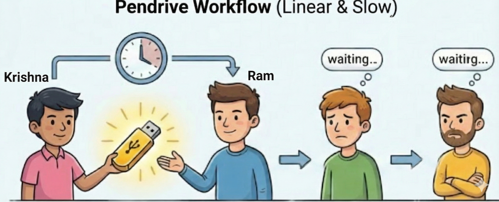
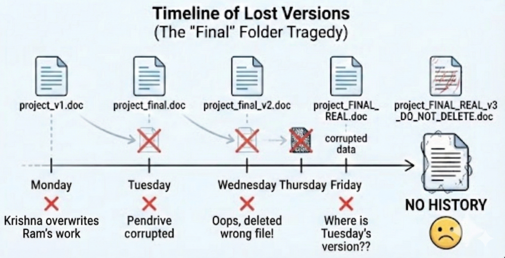
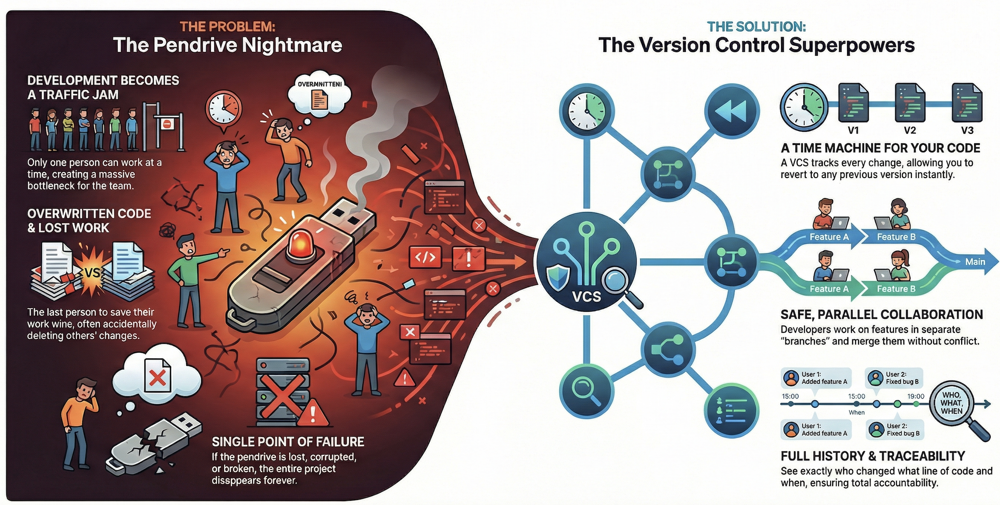

## Why Version Control Exists - The Pendrive Problem

**Analogy: The Pendrive Problem**

Let's imagine a world where version control systems like Git do not exist. Instead, developers rely on a simple pendrive to share and manage their code.

In this hypothetical nightmare (which was a reality for many developers in the 90s), there is no cloud repository. There is only `The Pendrive`. This ~1GB USB stick is the single source of truth. It contains the "working" code.

If you want to make changes to the code, you need The Pendrive. If you have The Pendrive, you hold the power. If you don’t? You wait.

Let’s explore the absolute chaos of the "Pendrive Workflow" and why Version Control Systems (VCS) arrived to save our sanity.

---

## The Messy Reality of Sharing Code

Here is how a standard Tuesday looks in a team of two developers—`Krishna` and `Ram`—without version control.

`09:00 AM:` Krishna grabs The Pendrive. He copies the code to his laptop to fix a critical login bug.

`09:30 AM:` Ram needs to work on the payment gateway. He asks Krishna for the drive.

`The Bottleneck:` Krishna shouts, _"I'm not done! If you take it now, the code is broken!"_ Ram has to sit there and spin around in his chair because he literally cannot code until Krishna is finished.

In this scenario, development isn't parallel; it's `serial`. It’s a traffic jam where only one car can move at a time.

### The "Final_Final_v2" Tragedy

Now, since Krishna is taking his sweet time, Ram gets frustrated. He decides to work on an old copy of the code he saved on his desktop last week. He writes brilliant code for three hours.

Finally, he gets The Pendrive. He opens the folder to save his work and sees this:

> `Project_Source_Code` -> `Project_Source_Code_Final` -> `Project_Source_Code_Final_FINAL` -> `Project_Source_Code_Final_v2_DO_NOT_DELETE`

Which one is the real one? Who knows!

Ram guesses. He copies his files onto the drive. `Disaster strikes.`

Because Ram was working on an old version, he just unknowingly overwrote the bug fix Krishna spent all morning writing. Krishna’s code is gone. There is no `Ctrl+Z` for a file replacement on a USB stick.

This brings us to the core horrors of the pre-VCS world:

### 1. The Merge Conflict Mystery

In modern Git, if you and I change the same line of code, Git screams at us (a merge conflict). It forces us to sit down and decide which code wins.

With the pendrive? `The last person to save wins.`
If I fix a bug, and you upload a file you worked on yesterday that _doesn't_ have the fix, my bug comes back from the dead. This leads to the infamous "I swear I fixed this yesterday!" conversation.

### 2. Timeline of Lost Versions

Beyond overwriting work, relying on a physical device introduces physical risks:

- **No History:** If the code breaks today, you can't easily revert to how it looked yesterday.
- **Corruption:** If the pendrive is lost, corrupted, or washed in a pair of jeans, the entire project is gone.

Eventually, the software world realized that this method was unsustainable. We needed a better way to manage changes, collaborate effectively, and maintain a history of modifications. This realization led to the birth of `Version Control Systems (VCS)`.

---

## What is Version Control?

A `Version Control System (VCS)` is software that manages project changes, allowing developers to store versions, compare updates, and revert when necessary.

Think of it as a `Time Machine` for your code. It tracks every alteration to a file or set of files, enabling developers to journey back to earlier versions and collaborate seamlessly. (1)

### The Superpowers of VCS

- **History Tracking:** Every change is recorded. You can see exactly who changed what line of code, and when they did it. (No more blaming the wrong person!)
- **Branching and Merging:** Developers can create "branches" (parallel universes) to work on features independently. Ram can work on payments while Krishna works on login, and they can merge their work later without overwriting each other.
- **Traceability:** Changes can be linked to specific issues or features, making it easier to understand the evolution of the codebase.
- **Safety:** Every change can be peer-reviewed before being merged, ensuring higher code quality and fewer broken builds.

---

## Conclusion

Every developer today needs to understand the basics of version control. It is the backbone of modern software development, enabling teams to collaborate effectively, maintain code quality, and manage complex projects with ease.

By moving away from the chaotic "Pendrive Method" to sophisticated systems like Git, developers can focus on what they do best: writing code and building amazing software—without the fear of losing it all on a Tuesday morning.

---

_(1)_ Reference: [GitLab - What is Version Control?\_](https://about.gitlab.com/topics/version-control/)
