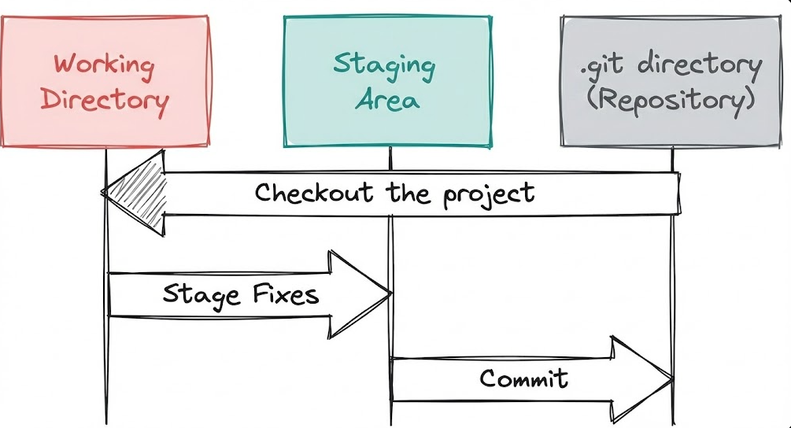
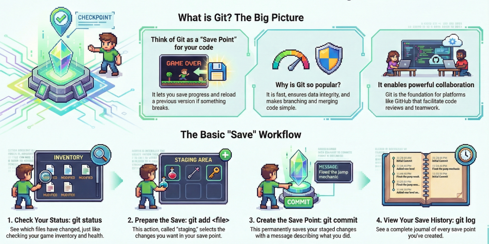

If you have ever played a video game, you know the anxiety of facing a difficult boss. What is the first thing you do before walking through that boss door? You save your game.

Why? Because if you rush in and lose all your health, you don't want to restart the entire game from level one. You want to respawn right where you were, with all your items and progress intact.

`Git` is exactly that—but for coding.

It allows you to create Save Points in your project. If you write a bunch of code and accidentally break your entire app, you don't have to panic. You just "reload" your last save, and you are back in business.

In this blog, we will go through the basics of Git, so that you can code without the fear of losing your progress.

## Introduction to Git

### What is Git?

Git is a distributed version control system - which means that code on a local machine is a complete version control repository. It helps developers to commit their local changes, test them and sync it with a remote repository when they are ready.

### Why Use Git?

The major difference between Git and any other version control system is the way git thinks about data. Most version control systems stores information as a list of file-based changes. But git stores as a set of files and the changes made to each file.

This approach has several advantages:

1. **Distributed Development**: Every developer has a full copy of the repository, including its history. This allows for offline work and faster access to project history.
2. **Branching and Merging**: Git makes it easy to create branches for new features or bug fixes. Merging these branches back into the main codebase is efficient and straightforward.
3. **Pull Requests and Code Reviews**: Platforms like GitHub and GitLab leverage Git's capabilities to facilitate collaboration through pull requests and code reviews.
4. **Data Integrity**: Git uses SHA-1 hashing to ensure the integrity of the data. Every file and commit is checksummed, and any corruption can be detected.
5. **Speed**: Git is designed to be fast. Most operations are performed locally, which makes tasks like committing, branching, and merging very quick.

### Core terms in Git

1. **Repository (Repo)**: A directory that contains your project files and the entire history of changes made to those files. This directory is pushed to a remote server like GitHub or GitLab.
2. **Branch**: A separate line of development in your repository. You can create branches to work on new features or bug fixes without affecting the main codebase.
3. **Commit**: "Save Point" - Every change you make to the files in your repository is saved as a commit. Each commit has a unique ID and a message describing the changes.
4. **Stage**: Selecting specifically which changes you want to include in your next commit.
5. **Head**: "tu es ici" - A marker indicating which Save Point (Commit) you are currently playing.

Its important also to understand about the `The Three States` in Git:

1. **Modified**: The changes have been made to the file but not yet committed in the database.
2. **Staged**: The changes have been staged for the next commit, only the staged changes will be included in the next commit.
3. **Committed**: The changes have been committed to the repository.



### Basic Git Commands

Let's go through some essential Git commands in perspective of a game:

1. Start a New game with `git init`: This command initializes a new Git repository in your project directory. It's like starting a new game.

```
mkdir git-game
cd git-game
git init
```

2. Check your current position with `git status`: This command shows the current state of your repository, including any changes that have been made but not yet committed. It's like checking your inventory and health status.

```
git status
```

3. Create Content - Create a file named story.txt and type "Chapter 1: The Hero Wakes Up." If you run `git status` now, the text will be Red. This means Git sees a new file, but it isn't prepared to be saved yet.

4. Prepare the Save - `git add`¯
   In a game, you might organize your inventory before saving. In Git, this is called Staging. We have to tell Git which files we want to put in the save capsule.

```
git add story.txt
```

:::tip
Type git add . to add EVERYTHING that changed at once.
:::

Run `git status` again. The file will turn Green. It is now "Staged" and ready to be committed.

5. Create the Save Point - `git commit`
   This is the moment you actually press the "Save" button. You must leave a message so you remember why you saved here.

```
git commit -m "Started the story with Chapter 1"
```

Success! You have created a permanent checkpoint. You can now delete story.txt, change it, or break it, and you will always be able to return to this exact state.

6. View Your Saves (`git log`)
   Want to see your list of save points?

```
git log
```

This prints a journal of every save, who made it, when they made it, and the message they left.

---

## Conclusion



So isnt it cool how Git lets you create Save Points in your coding journey? Which has made it so much easier to manage changes, collaborate with others, and keep your code safe. The best part is, Git allows you to make mistakes. And in programming, making mistakes is the only way to learn. So go ahead—break things, fix them, and commit often!
