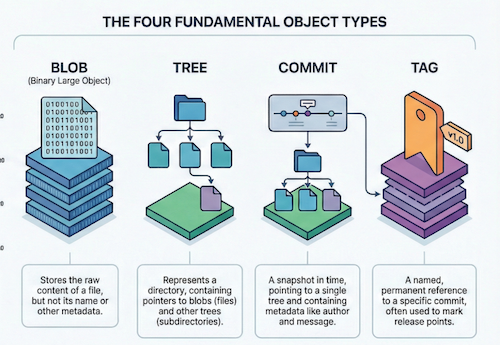
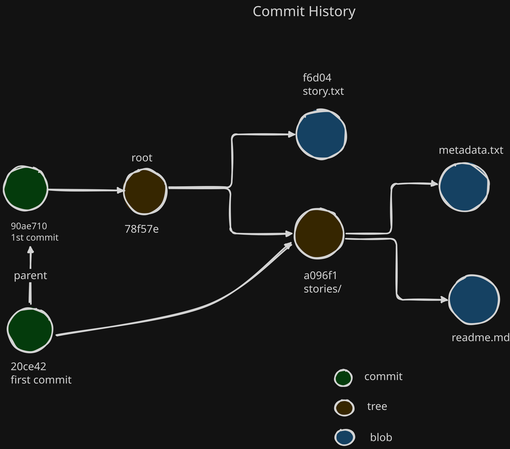
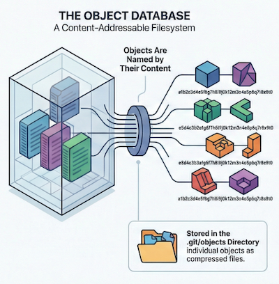

In the previous post, we learnt [How Git manages version control](post.html?post=git-essentials) through its internal structures. In this continuation, we will delve deeper into how git works internally and the specific components of the `.git` folder and their functions.

## Git Object Model

Git tracks changes by operating as a `content-addressable file system`, meaning all data is stored as objects and identified by a unique **SHA1 hash** based on their content, rather than tracking individual file edits, Git manages snapshots of your project's directory structure through a hierarchy of specific object types.

- **Blobs (Binary Large Objects):** These store the `actual content of a file`. A blob does not store metadata like file names or permissions; it is purely the data itself. If two files have identical content, even in different locations or commits, they will **share the same blob object**.
- **Trees:** These represent `directories`. A tree object stores file modes (permissions), object types (blob or another tree), SHA1 references, and **file names**. This allows Git to build a hierarchical structure where a root tree points to blobs (files) and other trees (subdirectories).
- **Commits:** These represent a `specific version or snapshot` of the project. A commit object points to a root tree and includes metadata such as the author, committer, date, and a commit message. Crucially, it also references **parent commits**, creating a directed acyclic graph (DAG) that forms the project's history.
- **Tags:** These provide a permanent reference to a specific commit, often used for version releases.



## How Git Tracks Changes

Let's look at the internals practically. We will create a repository, make two commits, and then "X-ray" the .git folder to see how Git maps these objects together.

The Setup
We start with a simple project structure:

```project/
├── story.txt
└── stories/
    └── story.txt
    └── readme.md
```

We initialize the repository (git init), which creates the hidden .git directory—the database where all our objects will live.

```bash
❯ git init

> Initialized empty Git repository in /path/to/project/.git/
```

The Staging Area (The Index)
Before we commit, we must add files.

```bash
❯ git add . -- adds all files to the staging area
```

What just happened internally? Git isn't just listing filenames. It is taking the content of every file, compressing it into a Blob (Binary Large Object), hashing it, and storing it in the .git/objects folder. The Index (or Staging Area) is a draft manifest. It maps your filenames to these new Blob hashes. It acts as a "construction zone" where the next tree is currently being assembled.

Commit 1: The Initial Snapshot

We commit our work:

```bash

❯ git commit -m "first commit"
> [main (root-commit) 90ae710] first commit
> 3 files changed, 3 insertions(+)
>  create mode 100644 stories/metadata.txt
>  create mode 100644 stories/readme.md
>  create mode 100644 story.txt
```

Now, let's play detective. We have a commit hash (90ae710). We can use `git cat-file -p (pretty print)` to look inside this object.

```bash
❯ git cat-file -p 90ae710

tree 78f57e9cce76cd70270e8e678fe13166c6aa3874
author  <author> 1768598520 +0100
committer <author> 1768598520 +0100

first commit
```

The commit object is tiny. It contains meta-data (author, time) and a single pointer to a Root Tree (78f57e9).

Let's look inside that Root Tree:

```bash

❯ git cat-file 78f57e9 -p
040000 tree a096f175360d158908baf1f8c25378635e90e9ea	stories
100644 blob f6d043db0fd669f2d8685b634b662e39fdacaf12	story.txt
```

This tree represents our project root. It points to one blob (story.txt) and another tree (stories folder). If we follow the stories tree (a096f1), we find the blobs for metadata.txt and readme.md.

Visualizing Commit 1 Here is how Git has mapped these objects. Note that arrows point away from the commit snapshot to the data.

Again when we look inside the `stories` tree object, we can see the files inside that directory:

```bash

❯ git cat-file a096f1 -p
100644 blob f6d043db0fd669f2d8685b634b662e39fdacaf12	metadata.txt
100644 blob 8728a858d9d21a8c78488c8b4e70e531b659141f	readme.md
```

Commit 2: The Evolution (The DAG)
Now, let's modify story.txt and commit again.

```bash
❯ echo "Additional content" >> story.txt
❯ git add .
❯ git commit -m "second commit"
[main d61c92a] second commit
 1 file changed, 1 insertion(+)
```

If we check the logs, we see a linear history:

```bash
❯ git log --oneline

d61c92a (HEAD -> main) second commit
90ae710 first commit
```

But the internal structure is more interesting. Let's inspect the Second Commit (d61c92a):

```bash
git cat-file d61c92a -p
tree 20ce426f8e3fdd9f1fd72813fa6674113df20781
parent 90ae71002a1512aa87565bead79f205a3469f58d

second commit
```

The Efficiency of Git Git created a new Blob for the modified story.txt and a new Root Tree to list it. However, look at the stories directory. We didn't touch it. Because the content inside stories/ didn't change, the hashes didn't change. Git doesn't create a copy; it simply points to the existing tree object from the first commit. Visualizing the DAG This is where the "Graph" in DAG comes from. Git reuses unchanged objects to save space and ensure integrity.



## The .git Folder - The Real Repository

The `.git` folder is the heart of a Git repository. It contains all the information about the repository, including configuration settings, references to branches and tags, and the object database that stores all the commits, trees, and blobs. Here are some key components of the `.git` folder:

- **HEAD:** This file points to the current branch reference, indicating which branch is currently checked out.
- **config:** This file contains repository-specific configuration settings.
- **refs:** This directory contains references to branches and tags.
- **objects:** This directory stores all the Git objects (blobs, trees, commits, and tags) in a compressed format.
- **index:** This file represents the staging area, tracking the state of the working directory.



## Conclusion

Understanding the internal workings of Git—the object model, the DAG, and the structure of the `.git` folder demystifies the tool we use daily. It explains why Git is so fast (local operations, efficient compression), why it's robust (immutable history, content integrity), and how it manages complex branching and merging.

By seeing Git not just as a set of commands but as a sophisticated content-addressable file system, we can better troubleshoot issues, optimize our workflows, and appreciate the elegance of its design. In the next post, we will explore advanced Git concepts like rebasing and cherry-picking, building on this foundational knowledge.
