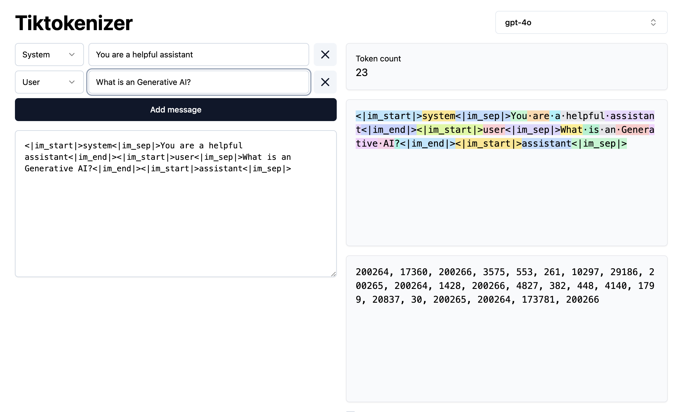

import SocialLinks from '@site/src/components/SocialLinks/socialLinks.js'

## Introduction

As a Data Engineer, I have worked with the data science team for integrating LLM within our data pipelines, that's 
when I thought it would be interesting to learn more about the Generative AI world. So I started exploring the Generative AI
world with Hitesh Choudhary's [gen-ai cohort](https://hitesh.ai/cohort), if the course excites you, 
you can use this [link](https://courses.chaicode.com/learn/fast-checkout/227321?priceId=0&code=VIBHAVAR51981&is_affiliate=true&tc=VIBHAVAR51981) to get a discount.
I will be sharing my learnings and experiences in this blog. Are you ready to decode the Gen AI jargons with me? Let's get started!

---
## What is Generative AI?

According to the [Wikipedia](https://en.wikipedia.org/wiki/Generative_artificial_intelligence), Generative artificial intelligence (Generative AI, GenAI or GAI) 
is a subset of artificial intelligence that uses <Highlight color="#3e6980">generative models</Highlight> to produce text, images, videos, or other forms of data.
These models <Highlight color="#3e6980">learn the underlying patterns and structures of their training data</Highlight> and use them to produce new data based on the input, 
which often comes in the form of natural language prompts.

Due to its ability to generate human-like text, images, videos and automating tasks using Agentic Workflows, Generative 
AI has gained significant attention and popularity in recent years. It has the potential to revolutionize various industries
like healthcare, finance, retail, education etc.

Common examples of Gen AI are ChatGPT, DALL-E, Claude etc are some of the most popular generative AI tools.

## Understanding GPTs (Generative Pre-trained Transformers)
- **Generative**: Refers to the model's ability to generate new content, such as text, images, or other data.
- **Pre-trained**: Indicates that the model has been trained on a large dataset before being fine-tuned for specific tasks.
- **Transformers**: Refers to the underlying architecture of the model, which is designed to process and generate sequences of data efficiently.

GPTs are first created by `OpenAI` and are based on the Transformer architecture. They are designed to understand and generate 
human-like text by learning from vast amounts of data. The **pre-trained** aspect means that these models are initially trained on a broad dataset, 
allowing them to learn grammar, facts, and some reasoning abilities before being fine-tuned for specific tasks.

GPTs are a family of neural network models that uses the transformer architecture and is a key advancement in artificial intelligence (AI) 
powering generative AI applications such as ChatGPT.

### Why is GPT important?
GPT models, especially their transformer architecture, are a big step forward in AI. 
They make tasks like translating languages, summarizing documents, writing blogs, creating websites, and designing visuals much faster and easier. 
For example, writing and editing a complex article might take hours, but a GPT model can do it in seconds. 
These models help organizations save time, boost productivity, and improve their applications and customer experiences.


## Breaking Down Transformers
Transformers are a type of neural network that learns contextual relationships between words in a sentence. Transformer models
apply an evolving set of mathematical techniques, called attention or self-attention, to detect subtle ways even distant 
data elements in a series influence and depend on each other.

### Tokenizers: Breaking Down Text
**Role:**
Converts your text into smaller pieces (tokens). Tokens can be whole words, parts of words, or punctuation marks.

**Example:**
Original Text: "Hello, world!"
Tokens: [“Hello”, “,”, “world”, “!”]

**Why It Matters:**
Tokenization makes text manageable and standardized for the AI to process.

### Encoders and Decoders: The Building Blocks

#### Encoders:
Encoders take these tokens (represented numerically after tokenization) and process them into a meaningful internal representation that captures context.

After tokenization, tokens are converted into numbers (embeddings). The encoder then uses these embeddings to capture deeper meanings and relationships.

**Example:**
If tokenization is about identifying puzzle pieces, encoding is like fitting these puzzle pieces together to understand what the picture represents.



#### Decoders:

Decoders take the encoded internal representation from the encoder (or from itself, if it's generating text token-by-token) and produce new text tokens as output.

**Example:**
If encoding puts the puzzle together, decoding is like explaining or describing the picture in simple language.

### Self-Attention: How Transformers "Think"
Self-attention is like reading a sentence and deciding how much attention to pay to each word based on their relevance to others.

Imagine you're reading, "The cat sat on the mat because it was tired." Here, "it" refers to the "cat." 
Self-attention helps the model understand this by relating "it" back to "cat."
Transformers use self-attention to weigh each word differently, focusing more on relevant words to accurately grasp the context and meaning.

An interesting article I found on self-attention is [The Illustrated Transformer](https://jalammar.github.io/illustrated-transformer/). Take a look at it if you want to understand the self-attention mechanism in detail.

### Multi-Head Attention: AI's Multitasking Ability
Multi-head attention allows transformers to simultaneously focus on different aspects of the input sequence. 
Imagine having multiple specialists each analyzing different parts of the same text at once—this collective analysis results 
in a richer understanding and improved performance of the AI model. 

For example, when analyzing a sentence like "She bought apples from the store after finishing her work," 
one attention head might focus on identifying the `action (buying)`, another on the `objects involved (apples, store)`, 
and another on the `sequence of events (after finishing work)`.

### Positional Encoding: Teaching AI About Order

Positional encoding helps transformers understand the <Highlight color="#3e6980">order of words in a sentence</Highlight>. 
Since transformers don't inherently understand sequences, positional encoding adds information about word positions. 
For example, "The dog chased the cat" versus "`The cat chased the dog`" conveys entirely different meanings due to word order. 
Positional encoding ensures that the transformer recognizes these differences. 

Another example is `He arrived before the meeting` versus `Before the meeting, he arrived,` where positional encoding helps 
the model correctly interpret timing and sequence relationships.

## How Generative AI Understands Language?
### Vector Embeddings: Turning Words into Numbers
Embeddings convert tokens into numeric vectors, capturing semantic meaning and relationships. 
Words with similar meanings or contexts are placed closer together in numerical space, enhancing the AI's understanding 
of language nuances. 

For instance, words like "happy" and "love" have similar embeddings and are located closer together compared to words 
like "sad" or "angry," which would be positioned further away. [^1]

### Semantic Mapping: Finding Meaning in Context
Semantic mapping organizes embeddings into meaningful structures based on context, helping AI models grasp subtle differences in meanings. 
For example, "bank" in the context of finance ("She deposited money at the bank.") versus "bank" referring to a riverbank ("He sat on the bank of the river.") 
are clearly distinguished through semantic mapping. Another example is distinguishing "apple" as a fruit from "Apple" as 
a technology company, based on the context provided.

## How Generative AI Actually Works (Step-by-Step Interaction)

### Step 1: User Query Submission
A user submits a prompt or query to the AI model. For example:
```
what is artificial intelligence?
```

### Step 2: Tokenization
The input text is broken down into tokens. 
For example, the sentence "what is artificial intelligence?" might be tokenized into ["what", "is", "artificial", "intelligence","?"] to simplify further processing.

```text
"what is artificial intelligence?" -> ["what", "is", "artificial", "intelligence","?"]
```

### Step 3: Creating Embeddings
Each token is converted into numeric embeddings capturing semantic meanings, such as placing "artificial" and "intelligence"
close together due to their frequent contextual relationship.

### Step 4: Positional Encoding
The model incorporates positional information to understand word order and context. 
For example, in the sentence `The cat chased the mouse,` positional encoding ensures the model understands the sequence 
and can differentiate it from `The mouse chased the cat.`

### Step 5: Transformer Layers and Self-Attention
Transformer layers apply self-attention to evaluate and weigh the importance of each word concerning others in the sentence,
helping the model grasp the overall sentiment and context.

### Step 6: Response Generation with Multi-Head Attention
Multiple attention heads simultaneously analyze different aspects of the context—such as emotional tone (love), the subject matter (artificial intelligence)—to create a nuanced response.

### Step 7: Adjusting AI Creativity with Temperature
The "temperature" parameter controls the randomness or creativity of the AI's responses. 
Lower temperatures yield predictable results, while higher temperatures produce more creative outputs.

Think like a chef adjusting the spice level in a dish. A low temperature (less spice) results in a safe, familiar flavor,
while a high temperature (more spice) leads to unexpected and exciting combinations.

### Step 8: Feedforward Neural Network
The model processes the output from the transformer layers through a feedforward neural network, refining the response further.
This network applies non-linear transformations to the data, enhancing the model's ability to understand complex relationships.

## Additional Concepts You Should Know

### Knowledge Cutoff: Why AI Doesn’t Know Everything
Knowledge cutoff represents the date up to which the AI model was trained. 
Information after this cutoff isn't available to the model, limiting its current knowledge.


If you liked reading this blog, I would love to hear your thoughts, feel free to contact me on below social platform :)
<SocialLinks />

---
[^1]: [Vector-Space](https://projector.tensorflow.org/)

